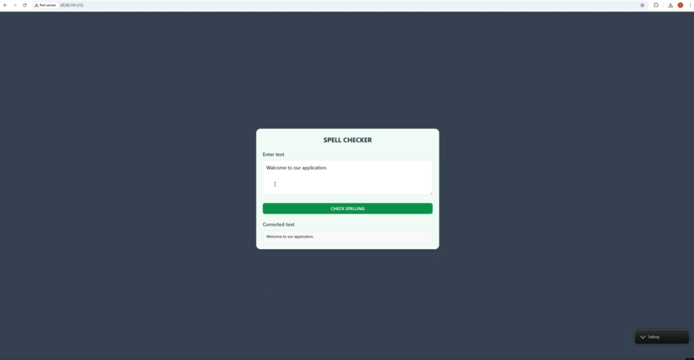
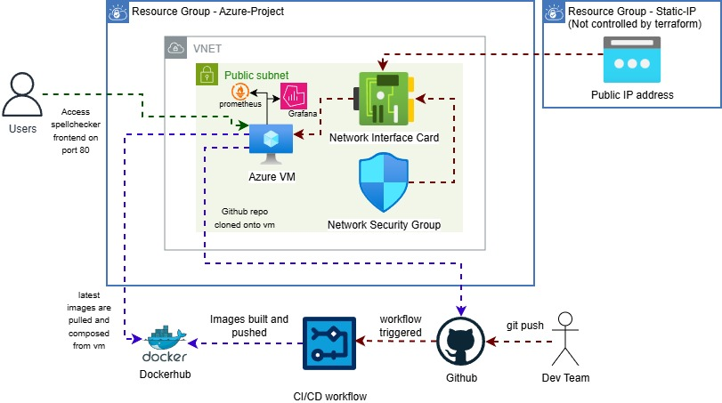
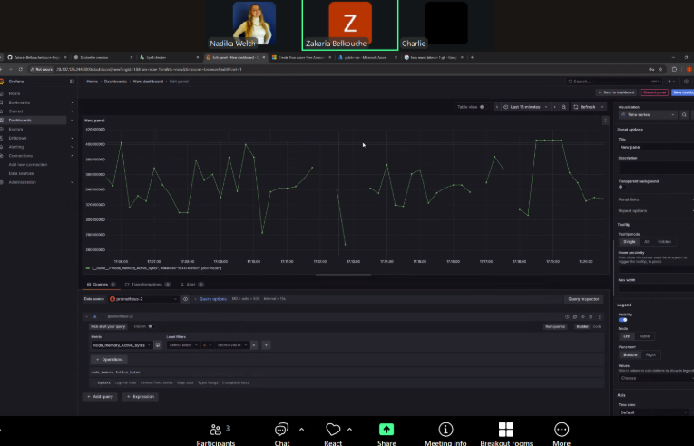

# 🧙‍♂️ CODE MAGICIANS — Team Members

**Zakaria Belkouche** — Infra Engineer / SRE  
**Charlie Hunger** — Infra Engineer / SRE  
**Nadika Welch** — Software Engineer / SRE  

---

# Spell Checker App, Full Stack Deployment with Terraform, Docker & Azure
A full-stack Spell Checker application built with React (frontend) and Django (backend), fully deployed on Microsoft Azure using Terraform, Docker, and monitored with Prometheus & Grafana. CI/CD automation is handled through GitHub Actions.

---

## Project Diagram

 ## Features Overview
 
### Frontend (React)
- User text input and API calls with fetch()
- React Hooks (useState) for managing state
- Displays corrected text, loading, and error messages

### Backend (Django)
- REST API endpoints (/api/health)
- Processes text and returns corrected output as JSON
- Includes Django unit tests

## Cloud Infrastructure 
### Created using Terraform:
- Azure Resource Group
- Virtual Network + Public/Private Subnets
- Ubuntu Linux VM
- Network Security Group with firewall rules (SSH, HTTP, API, Prometheus, Grafana)

## Dockerised Deployment
### The Azure VM runs all components via Docker:
- React frontend
- Django backend
- Prometheus
- Grafana
- Node Exporter
- Blackbox Exporter

## Monitoring
### Prometheus monitors:
Prometheus monitors VM performance and conducts frontend health checks on port 80. Grafana displays these metrics through dashboards showing CPU, memory, and overall system health.

---

## Local Development. Usage
### Backend:
- `cd backend`
- Create a virtual environment
- `python -m venv .venv`
- Activate the virtual environment
#### Windows:
 `.venv\Scripts\activate`
#### macOS / Linux:
 `source .venv/bin/activate`
  
- `pip install -r requirements.txt`
- `python manage.py runserver`

### Frontend:
- `cd frontend`
- `npm install`
- `npm run dev`

## Contributions
Contributions are welcome. If you find any bugs or want to improve the project, feel free to fork the repo, make your changes, and submit a pull request.
